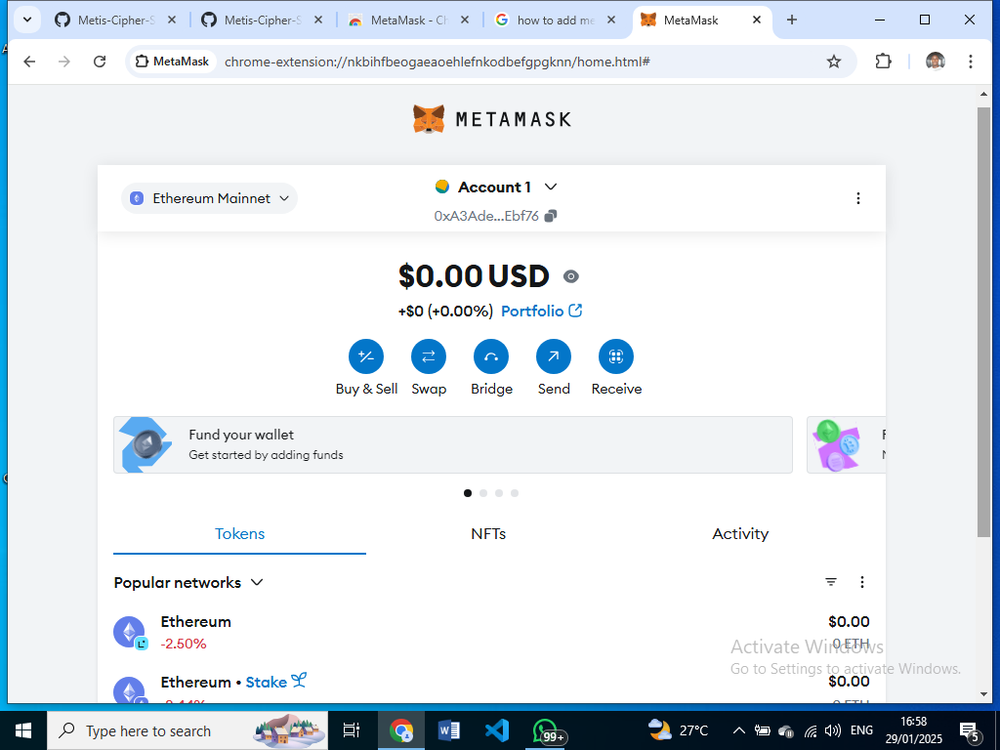

<h2>Week 1A Tasks</h2>
 

<h3>Part One</h3>
<h4>Applications of Blockchain in Industry<h4>
<ul>
<li> <b> Delivery systems: </b> Blockchain technology enables the immutability of tracking data and other logistical information on goods being transported.</li>
<li> <b> Financial institutions: </b> Blockchain technologies allow for greater security, peer-to-peer transactions, and non-repudiation of transactions. </li>
<li> <b> Healthcare systems: </b> The blockchain allows for safer storage and management of patient data. </li>
<li> <b> Electorial systems: </b> The blockchain allows for casted votes to be unaltered in order to avoid what happened in Nigeria in 2023. </li>
<li> <b> Security systems: </b> The blockchain would make it possible for events and documented incidents to remain unaltered and open to future review. </li>
<li> <b> Real Estate: </b> The blockchain would make it easier to carry out background and ownership checks on immovable properties and reduce the rate of land-purchase scams. </li>
<li> <b> Content Creation: </b> Blockchain Technology would reduce the rate of censorship and control of content by third-parties in the social media space. </li>
<li> <b> Legal Activities: </b> The blockchain would make it nearly impossible to modify and tamper with legal documents. </li>
<li> <b> Education: </b> The blockchain would make it easier to monitor the performances of students and guard against malpractical activities like illegal score modification. 
<li> <b> Paternity: </b> With the blockchain, cases of paternity fraud can be reduced as DNA tests taken at the hospital can not be denied or modified later on (wahala for women). 
</ul>

 

<h3> Part Two </h3>
<h4> Components of A Blockchain Network </h4>
<ol>
<li> <b>Nodes:</b> These are computers on the Ethereum network that validate transactions and store data. </li>
<li> <b> Smart Contracts: </b> These are self-executing programs that run on the blockchain. They execute their tasks whenever some conditions are met.</li>
<li> <b> Ethereum Virtual Machine: </b> This is the runtime environment for smart contracts on the Ethereum Blockchain </li>
<li> <b> Blocks: </b> These are transactions that have been performed on the network have been stored. </li>
<li> <b> Consensus Mechanisms: </b>These are protocols used to validate blocks on the blockchain. They may involve solving complex problems (Proof of Work) or stake currencies (Proof of Stake).</li>
</ol>

<h4> How To Track a Transaction on Etherscan.com</h4>
<ol>
<li> Go to etherscan.com. </li>
<li> Paste the name of a Token, Hash, Wallet Address, etc. in the search bar and search. </li>
<li> You'll be shown details like the creators name, gas fees, transaction fees, etc. </li>
</ol>

<h3> Part Three </h3>
<h4> Importance of Decentralization in Blockchain. </h4>

 Decentralization is very important in Blockchain because it
<ul>
<li> Ensures there is no central authority controlling the transaction.</li>
<li> The data is stored on multiple computers, making it harder to hack and compromise the data. </li>
<li> There is no single computer which when crashed would bring down the enter blockchain. </li>
</ul>

<h4> Transparency and Security on Blockchains </h4>

 Blockchain platforms ensure transparency by having multiple copies of the transaction data. Because the data is decentralized, no central authority can dictate or manipulate the system

 

 Blockchain platforms ensure security by making use of consensus mechanisms, cryptography, and decentralization.

<h3> Part Four </h3>
<h4> Difference between Bitcoin and Ethereum </h4>.

Bitcoin was made to be a platform to allow peer-to-peer digital currency exchange. Ethereum was made to allow Smart Contracts automate transactions.

<h4> Layer 2 Solutions</h4>

 Layer 2 solutions improve scalability by making some of the transactions "off-chain", meaning there is less load on the main chain.

 A popular Layer 2 solution is Eclipse; it employs the Solana blockchain to scale up the Ethereum blockchain. 

 Another Layer 2 solution is the Metis Blockchain which bundles up multiple transactions off-chain before sending a roll-up of the transactions to the main Ethereum blockchain

<h4> Metamask wallet </h4>

