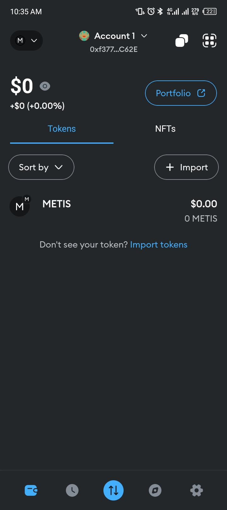

# **Part one**

---

### 1. **Finance: Cryptocurrency and Payment Systems**
   - **Example**: Bitcoin and Ethereum
     - Blockchain underpins cryptocurrencies like Bitcoin, providing secure, decentralised, and tamper-proof ledgers for transactions.
     - Companies like **Ripple** use blockchain for cross-border payments, reducing transaction costs and processing times.

---

### 2. **Supply Chain and Logistics: Traceability**
   - **Example**: IBM Food Trust
     - Blockchain ensures transparency in supply chains by tracking products from origin to consumer.
     - IBM Food Trust collaborates with companies like **Walmart** to track the journey of food items, improving food safety and minimising waste.

---

### 3. **Healthcare: Secure Patient Records**
   - **Example**: MedRec
     - Blockchain secures and decentralises medical records, giving patients control over their data.
     - **MedRec**, developed by MIT, allows for safe sharing of medical records among healthcare providers while maintaining patient privacy.

---

### 4. **Real Estate: Transparent Transactions**
   - **Example**: Propy
     - Propy uses blockchain to simplify property transactions by enabling smart contracts for real estate deals.
     - This eliminates intermediaries and fraud, making property purchases faster and more secure.

---

### 5. **Energy: Peer-to-Peer Energy Trading**
   - **Example**: Power Ledger
     - Blockchain enables individuals to trade excess solar energy with their neighbours.
     - Companies like **Power Ledger** use blockchain to facilitate transparent and efficient energy trading systems.

---

### 6. **Voting Systems: Transparent Elections**
   - **Example**: Voatz
     - Blockchain is used to secure digital voting systems, ensuring transparency and preventing voter fraud.
     - **Voatz** has been used in pilot programs in the U.S. to allow overseas military personnel to vote securely.

---

### 7. **Intellectual Property: Copyright Protection**
   - **Example**: KodakONE
     - KodakONE is a blockchain-based platform that tracks the use of copyrighted images.
     - Photographers can use it to protect their work and ensure they’re paid royalties for its usage.

---

### 8. **Education: Credential Verification**
   - **Example**: Blockcerts
     - Blockchain is used to issue tamper-proof academic certificates.
     - **Blockcerts** allows universities to store credentials on the blockchain, making them easily verifiable for employers.

---

### 9. **Retail and E-commerce: Loyalty Programs**
   - **Example**: Starbucks and Bakkt
     - Starbucks integrates blockchain-based loyalty rewards with the Bakkt app, enabling customers to pay using digital assets.
     - Blockchain ensures seamless and secure tracking of reward points.

---

### 10. **Charity: Transparent Donations**
   - **Example**: Binance Charity Foundation
     - Blockchain ensures that donations reach intended recipients without being misappropriated.
     - Platforms like **Binance Charity** provide transparency by showing donors how their funds are used in real-time.

---

### **How Blockchain add value**

---

### 1. **Finance: Cryptocurrency and Payment Systems**
   - **Value Added**: Blockchain eliminates intermediaries, reduces transaction costs, and ensures secure, tamper-proof transactions. It enables faster cross-border payments with enhanced transparency.

---

### 2. **Supply Chain and Logistics: Traceability**
   - **Value Added**: Blockchain provides an immutable record of a product’s journey, enhancing transparency, trust, and efficiency. It reduces fraud, improves quality control, and ensures accountability.

---

### 3. **Healthcare: Secure Patient Records**
   - **Value Added**: Blockchain ensures the privacy and security of patient data while enabling seamless and secure sharing of medical records. Patients retain control over their sensitive information.

---

### 4. **Real Estate: Transparent Transactions**
   - **Value Added**: Blockchain eliminates the need for intermediaries, reducing transaction costs and risks. It streamlines property transactions with smart contracts, ensuring transparency and faster processing.

---

### 5. **Energy: Peer-to-Peer Energy Trading**
   - **Value Added**: Blockchain enables decentralised energy trading, allowing individuals to securely trade energy without middlemen. This promotes efficiency and reduces costs.

---

### 6. **Voting Systems: Transparent Elections**
   - **Value Added**: Blockchain ensures transparency, security, and integrity in voting systems. It prevents fraud, enables auditability, and builds trust in election outcomes.

---

### 7. **Intellectual Property: Copyright Protection**
   - **Value Added**: Blockchain creates a secure record of ownership and usage rights for creative works. This ensures creators are properly credited and paid, reducing copyright infringement.

---

### 8. **Education: Credential Verification**
   - **Value Added**: Blockchain makes credentials tamper-proof and easily verifiable, reducing fraud and improving trust between educational institutions, employers, and students.

---

### 9. **Retail and E-commerce: Loyalty Programs**
   - **Value Added**: Blockchain simplifies and secures loyalty programs by ensuring accurate tracking of reward points and seamless redemption, enhancing customer satisfaction and trust.

---

### 10. **Charity: Transparent Donations**
   - **Value Added**: Blockchain provides transparency in how donations are used, ensuring funds reach their intended recipients. This builds trust and encourages more people to contribute.

---

# **Part Two**

### 1. **Components of a Blockchain: Analysis of Ethereum**
Ethereum, like other blockchains, has several key components that enable it to function. Below is a breakdown of these components:

#### **a. Distributed Ledger**
   - Ethereum maintains a decentralised ledger where all transactions and smart contracts are stored. Every participant (node) has a copy of the entire blockchain, ensuring transparency and redundancy.

#### **b. Blocks**
   - A block is a data structure that records a set of transactions. Ethereum's blocks also include additional information, such as the hash of the previous block, a timestamp, and metadata about the block.

#### **c. Transactions**
   - Transactions are the fundamental operations recorded on the blockchain. They can involve transferring Ether (ETH) or executing smart contracts.

#### **d. Nodes**
   - Nodes are computers that participate in the Ethereum network. They validate transactions, execute smart contracts, and maintain a copy of the blockchain. Types of nodes include:
     - **Full Nodes**: Store the entire blockchain and validate transactions.
     - **Light Nodes**: Store only part of the blockchain and rely on full nodes for data.

#### **e. Smart Contracts**
   - Ethereum allows developers to write and deploy smart contracts, which are self-executing programs that run on the blockchain. These contracts are written in Solidity and executed on the Ethereum Virtual Machine (EVM).

#### **f. Consensus Mechanism**
   - Ethereum currently uses **Proof of Stake (PoS)** as its consensus mechanism (following the Ethereum 2.0 upgrade). Validators stake ETH to propose and validate new blocks, ensuring the integrity of the blockchain.

#### **g. Gas and Fees**
   - Transactions and smart contract executions require computational resources, measured in "gas." Users pay gas fees in ETH, incentivising validators and ensuring efficient use of resources.

#### **h. Cryptographic Hash Functions**
   - Ethereum relies on cryptographic hash functions to secure the blockchain. For example:
     - Each block references the hash of the previous block.
     - Transactions and data are hashed to ensure integrity.

#### **i. Wallets**
   - Wallets store private and public keys, enabling users to interact with the blockchain. They are essential for sending/receiving Ether and interacting with smart contracts.

#### **j. Ethereum Virtual Machine (EVM)**
   - The EVM is the runtime environment for smart contracts. It ensures that all nodes execute smart contracts in a consistent and deterministic manner.

---

### 2. **How to Track a Transaction on a Blockchain (Using Etherscan)**
A public blockchain explorer like **Etherscan** allows anyone to view Ethereum transactions. Here’s how you can track a transaction:

#### **Step-by-Step Process**:

1. **Obtain the Transaction Hash (TxHash):**
   - A transaction hash is a unique identifier for a transaction. You can get this from your wallet, exchange, or the platform where you initiated the transaction.

2. **Open Etherscan:**
   - Visit [Etherscan.io](https://etherscan.io/), the official Ethereum blockchain explorer.

3. **Enter the Transaction Hash:**
   - Paste the transaction hash into the search bar at the top of the Etherscan homepage and hit "Enter."

4. **View the Transaction Details:**
   - Once the transaction hash is located, the following details will be displayed:
     - **Status**: Indicates whether the transaction is pending, successful, or failed.
     - **Block Number**: The block in which the transaction was included.
     - **From and To Addresses**: The sender and recipient wallet addresses.
     - **Value**: The amount of Ether transferred.
     - **Gas Fees**: The amount of gas paid for the transaction.
     - **Timestamp**: The date and time the transaction was confirmed.

5. **Track Confirmations:**
   - Etherscan will also show how many confirmations the transaction has received. More confirmations indicate greater reliability and finality.

6. **Inspect Related Contracts or Tokens:**
   - If the transaction involves a token transfer or interaction with a smart contract, additional details such as token type (e.g., ERC-20) and contract address will be displayed.

---

### Example: Tracking a Transaction
   - **Transaction Hash**: `0x9c7d...`
   - Enter this hash on Etherscan to find details such as:
     - Sender: `0x123...`
     - Receiver: `0xabc...`
     - Value: `0.5 ETH`
     - Status: Successful
     - Gas Fee: `0.00021 ETH`
     - Confirmations: 12+

This transparency is a hallmark of blockchain technology, enabling trust and accountability in the network.

---

### **Why is Decentralisation Important in Blockchain?**

Decentralisation is a core principle of blockchain technology and offers the following benefits:

1. **Eliminates Single Points of Failure**:
   - In a decentralised network, data is distributed across multiple nodes. Unlike centralised systems, where failure at a single point (e.g., a server crash or hack) can disrupt the system, blockchain ensures continuous operation by replicating data across the network.

2. **Enhances Security**:
   - Decentralisation makes it extremely difficult for bad actors to manipulate the blockchain. To alter data, an attacker would need to compromise a majority of the network nodes simultaneously, which is computationally infeasible for large networks like Bitcoin or Ethereum.

3. **Promotes Trust**:
   - In decentralised systems, no single authority controls the network. This removes the need to trust intermediaries, as users trust the blockchain’s consensus mechanism instead.

4. **Increases Data Integrity**:
   - Because all participants (nodes) store and validate data, decentralisation ensures that records on the blockchain are consistent and tamper-proof.

5. **Censorship Resistance**:
   - Decentralisation prevents any entity or authority from controlling or censoring the blockchain. Transactions and data remain accessible and unaltered, ensuring openness and freedom.

6. **Facilitates Peer-to-Peer Transactions**:
   - Decentralisation removes intermediaries, allowing direct transactions between participants. This reduces transaction costs, speeds up processing, and promotes inclusivity.

---

### **How Does Blockchain Ensure Transparency and Security?**

Blockchain ensures both **transparency** and **security** through its design and mechanisms:

#### **1. Transparency**:
   - **Immutable Public Ledger**:
     - Blockchain maintains a public ledger where all transactions are recorded and viewable by anyone with access to the network. For example, platforms like **Etherscan** allow users to track transactions in real-time.
   - **Shared Record-Keeping**:
     - Every node in the network has a copy of the entire blockchain. This ensures that all participants can independently verify data, reducing the risk of misinformation or fraud.
   - **Accountability**:
     - Users can trace the origin of transactions and verify the parties involved. While blockchain preserves anonymity through cryptographic addresses, transaction history remains visible.

#### **2. Security**:
   - **Cryptographic Hashing**:
     - Transactions and data are secured using cryptographic hash functions (e.g., SHA-256). Once data is added to a block, it is converted into a unique hash, making it virtually impossible to alter without detection.
   - **Consensus Mechanisms**:
     - Blockchain relies on consensus protocols like **Proof of Work (PoW)** or **Proof of Stake (PoS)** to validate transactions. These mechanisms ensure that only valid transactions are added to the blockchain.
   - **Decentralisation**:
     - With data distributed across many nodes, no single entity controls the blockchain, making it resistant to tampering and cyberattacks.
   - **Immutable Data**:
     - Once data is added to the blockchain, it cannot be altered without consensus from the majority of nodes. This immutability protects against fraud and ensures data integrity.
   - **Private-Public Key Cryptography**:
     - Blockchain uses cryptographic keys to secure access. Users sign transactions with their private keys, ensuring authenticity, while public keys allow others to verify the signature without exposing sensitive information.

---

### **Differences Between Bitcoin and Ethereum in Terms of Purpose and Functionality**

| **Feature**          | **Bitcoin**                                   | **Ethereum**                               |
|-----------------------|-----------------------------------------------|--------------------------------------------|
| **Purpose**           | Digital currency (store of value and medium of exchange). | Decentralised platform for smart contracts and decentralised applications (DApps). |
| **Launch Year**       | 2009                                          | 2015                                       |
| **Creator**           | Satoshi Nakamoto                              | Vitalik Buterin                            |
| **Consensus Mechanism** | Proof of Work (PoW) (originally) and will remain PoW. | Transitioned to Proof of Stake (PoS) with Ethereum 2.0. |
| **Blockchain Functionality** | Primarily focused on enabling peer-to-peer payments. | A programmable blockchain for creating and executing smart contracts. |
| **Smart Contracts**   | Not supported.                               | Fully supports smart contracts, allowing for complex programmability. |
| **Token**             | Bitcoin (BTC).                               | Ether (ETH), used to pay gas fees and incentivise validators. |
| **Block Time**        | ~10 minutes.                                 | ~12-15 seconds (much faster than Bitcoin). |
| **Supply Cap**        | Fixed at 21 million BTC.                     | No fixed supply cap for ETH, but its issuance is regulated. |
| **Primary Use Cases** | Digital gold, remittances, secure transactions. | Decentralised finance (DeFi), NFTs, DApps, and tokenisation. |

**Summary**:
- **Bitcoin** is primarily designed as a secure and decentralised digital currency.
- **Ethereum** goes beyond currency to provide a platform for building decentralised applications using smart contracts.

---

### **Layer 2 Solutions: Improving Blockchain Scalability**

**Layer 2 solutions** are technologies built on top of a blockchain (Layer 1) to address its scalability issues, such as slow transaction speeds and high fees. By offloading some computational or transactional workload from Layer 1, they improve efficiency and reduce costs.

#### **How Layer 2 Solutions Improve Scalability**
1. **Off-Chain Processing**:
   - Layer 2 processes most transactions off the main blockchain (Layer 1) and only settles final results on-chain, reducing the computational burden.
   
2. **Reduced Congestion**:
   - By offloading transactions, Layer 2 reduces congestion on the main chain, improving transaction throughput.
   
3. **Lower Gas Fees**:
   - Performing transactions off-chain significantly lowers gas fees, as Layer 2 solutions aggregate many transactions before interacting with the Layer 1 blockchain.

#### **Examples of Layer 2 Solutions**

1. **Metis**:
   - **What It Is**: Metis is a Layer 2 solution built on Ethereum using **Optimistic Rollups** technology.
   - **How It Works**:
     - Metis bundles multiple transactions into a single batch and processes them off-chain.
     - Only the final state is submitted to the Ethereum blockchain, which drastically reduces gas fees and transaction times.
     - It supports decentralised applications (DApps) and provides additional features like governance, storage, and community tools.

2. **Polygon (Previously Matic Network)**:
   - **What It Is**: Polygon is a Layer 2 scaling platform for Ethereum, using **Sidechains** to process transactions.
   - **How It Works**:
     - Polygon creates parallel sidechains to handle transactions off the main Ethereum chain.
     - These sidechains periodically settle with the Ethereum mainnet, ensuring security and finality.
     - Polygon supports high throughput and low gas fees, making it popular for gaming, DeFi, and NFTs.

#### **Other Notable Layer 2 Solutions**:
   - **Arbitrum** (uses Optimistic Rollups for Ethereum scalability).
   - **Lightning Network** (Layer 2 for Bitcoin, focusing on fast microtransactions).

---

  

---

