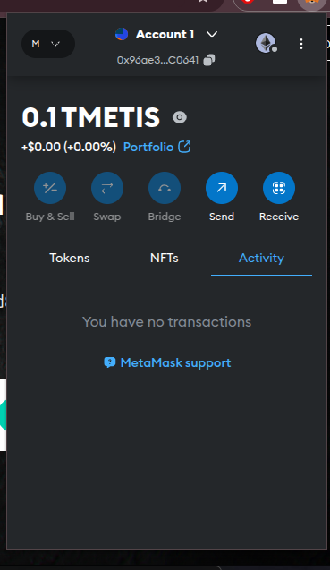
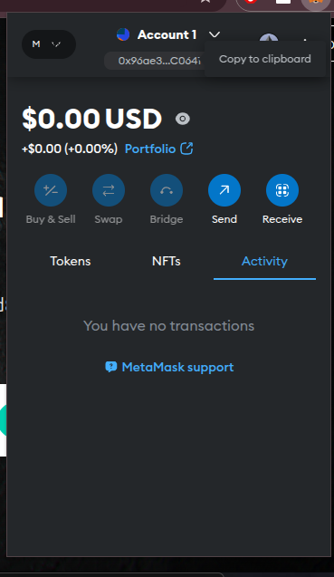

# Intro to Blockchain, With real-world use Cases

## Real World Examples of Block Chain Usage

1. **Property Tokenization:** this involves dividing real estate assets into tradable digital tokens, thereby lowering investment barriers and enable global real-estate investment.

1. **Peer-to-Peer Energy Trading:** this would enable consumers buy and sell renewable energy directly, enabling local energy markets and more efficient distribution.

1. **Cross-border Payments:** Blockchain tech allows for easy, faster and cheaper international money transfers.

1. **Decentralized Finance(DeFi):** Smart contracts deployed on the blockchain can be used to automate loan agreements, and
enables global financial access for the unbanked populations

1. **Pharmaceutical Supply Chain:** The blockchain can be used to verify drug authenticity

1. **Traceability and Transparency:** the blockchain can be used to track food products from farm to store, which helps improve food safety and reduce food waste.

1. **Medical Record Management:** Blockchain can be used to create secure, interoperable patient records which allows patients to easily control and share their medical records/history.

1. **Voting Systems:** Implementing voting systems with blockchain tech would increase election transparency and reduce fraud potential.

1. **Government, Charity and Non-profit - Funds/Donation Transparency:** the blockchain can be used to track fund usage and allocation. This would reduce administrative corruption.

1. **Decentralized Identity Management:** This would enable individuals create portable digital identities and Enable secure, privacy-preserving authentication.

## Components of the Blockchain and how Ethereum works

Here are some important components of the Ethereum blockchain:

1. **Consensus Mechanism:** The Consensus mechanism is the algorithm that allows nodes/individuals agree on the state of the blockchain. Ethereum uses the Proof of Stake(PoS) consensus mechanism.

1. **Network Nodes:** These are computers running the Ethereum client software. They perform actions like validating transactions, maintain the blockchain state.

1. **Smart Contracts:** These are self-executing code stored on the blockchain.

1. **Ethereum Virtual Machine (EVM):** This is the decentralized computing platform where the smart contract code is executed.

1. **CryptoCurrency (Ether):** This is the native token of the blockchain, used for transaction/gas fees, network participation and also used to incentivize network members, security and operations.

1. **Mempool:** This is the temporary storage of unconfirmed transactions.

## The Purpose of the Blockchain and the concept of Decentralization

Decentralization is crucial in blockchain for several reasons:

1. **Security:** As there is no single point of failure, it is harder for hackers to gain access, or control the network.

1. **Trust:** Decentralization ensures the removal of central authority control, providing transparent, verifiable transactions.

1. **Censorship Resistance:** Decentralization enables information and financial freedom as no single entity can block a transaction on the blockchain.

1. **Data Integrity:** Transactions of the blockchain are immutable, preventing retroactive alterations.

Blockchains operate on a network of distributed nodes (computers). Every node has a copy of the entire blockchain ledger, making it almost impossible for any single entity to alter or corrupt the data without the consensus of the network.

Since the ledger is distributed across many nodes, there’s no single point of failure. Even if some nodes are compromised, the system remains operational.

## Difference between Bitcoin and Ethereum

Bitcoin was created as a decentralized digital currency. Its primary aim is to serve as an alternative to traditional fiat currencies, enabling peer-to-peer transactions without the need for intermediaries like banks.

Ethereum was developed to expand the potential of blockchain technology beyond simple transactions. It serves as a decentralized platform for building and deploying smart contracts and decentralized applications (dApps).

Bitcoin operates on a blockchain that records all transactions in a public ledger. It employs a Proof of Work (PoW) consensus mechanism, where miners solve complex mathematical problems to validate transactions and secure the network. This design emphasizes security and immutability but can result in slower transaction times and higher energy consumption.

Ethereum's blockchain is programmable, allowing developers to create self-executing contracts (smart contracts) that run when predefined conditions are met. This flexibility has led to a wide array of applications, from decentralized finance (DeFi) platforms to non-fungible tokens (NFTs). Ethereum initially used a PoW consensus mechanism but has transitioned to Proof of Stake (PoS) with Ethereum 2.0, aiming to improve scalability and reduce energy consumption.

## The Role of L2s on the Blockchain

As the adoption of blockchain grows, so does the demand for scalability—the ability to handle an increasing number of transactions efficiently. Layer 2 solutions have been introduced to enhance blockchain scalability without compromising security or decentralization.

Layer 2 solutions are protocols built on an existing blockchain (Layer 1) to improve transaction speed and throughput. Instead of processing every transaction on the main blockchain, Layer 2 handles transactions off-chain and periodically settles them on the main chain. This approach reduces congestion, lowers transaction fees, and increases the network's capacity.

## Examples of L2 solutions

- **Metis** is a Layer 2 scaling solution for Ethereum that utilizes an Optimistic Rollup architecture. It aims to enhance scalability while providing a robust framework for decentralized applications (dApps) and decentralized autonomous organizations (DAOs).

- **Lightning Network** is a Layer 2 scaling solution designed for Bitcoin. It enables fast, low-cost transactions by creating off-chain payment channels between users.

## Metis

