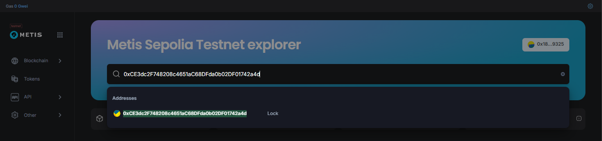
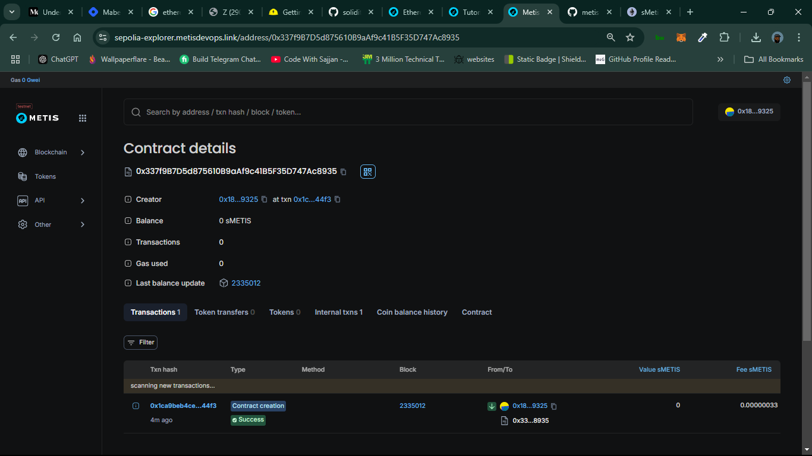
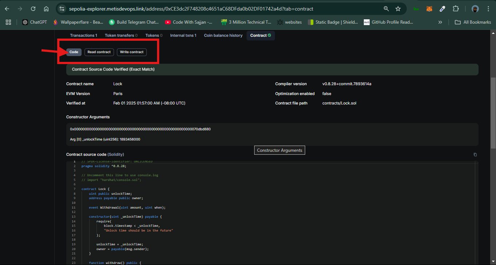

# Smart Contract Verification via Hardhat on the Metis Blockchain

Smart contract verification is the process of confirming that the source code of a deployed smart contract on a blockchain matches the bytecode that is actually running, essentially ensuring transparency and security by allowing users to independently check if the contract functions as intended, without hidden vulnerabilities; it's crucial because it builds trust among users and helps identify potential security flaws in the contract logic before significant funds are interacted with. 

The following guide explains how to verify smart contracts deployed via Hardhat on the Metis blockchain using the [hardhat-verify](https://hardhat.org/hardhat-runner/plugins/nomicfoundation-hardhat-verify) plugin you can read more about the plugin [here](https://hardhat.org/hardhat-runner/plugins/nomicfoundation-hardhat-verify).

## Install Hardhat

If you are starting from scratch, create an npm project by going to an empty folder, running `npm init -y`. npm 7 or higher is recommended.

Once your project is ready, run:

```npm
npm install --save-dev hardhat
```

## Create a project

In your project folder, run: 

```bash
npx hardhat
```
follow the instructions to create a new hardhat project. [more info here](https://hardhat.org/getting-started/#quick-start)

## Install plugin:

 Ensure that you have the [hardhat-verify plugin](https://hardhat.org/hardhat-runner/plugins/nomicfoundation-hardhat-verify) installed in your project. To install, run:

```npm
npm install --save-dev @nomicfoundation/hardhat-verify
```

## Configure Hardhat for Metis:

Your basic Hardhat config file (`hardhat.config.js` or `hardhat.config.ts`) will be setup to support the network you are working on. In this example we use the Metis Sepolia test network and a `.js` file. [More info on using typescript with hardhat available here](https://hardhat.org/guides/typescript.html#typescript-support). 

In your `hardhat.config.js` file, include the following:

  ```javascript
  require("@nomicfoundation/hardhat-toolbox");
  require("@nomicfoundation/hardhat-verify");
  require("dotenv").config();

  const PRIVATE_KEY = process.env.PRIVATE_KEY;
  const RPC_URL = process.env.RPC_URL;

  module.exports = {
    solidity: "0.8.28",
    networks: {
      metisSepolia: {
      url: RPC_URL,
      accounts: PRIVATE_KEY ? [PRIVATE_KEY] : [],
      chainId: 59902,
      },
  },
  etherscan: {
    apiKey: {
      metisSepolia: "any-non-empty-string", 
  //Metis doesn't require an API key for verication. You can use any non-empty string as a placeholder.
    },
    customChains: [
      {
        network: "metisSepolia",
        chainId: 59902,
        urls: {
          apiURL: "https://sepolia-explorer-api.metisdevops.link/api",
          browserURL: "https://sepolia-explorer.metisdevops.link",
        },
      },
    ],  
  }
  };
  ```
## Configure .env File for your Private Key and RPC URL:

  - Install the dotenv package to handle environment variables:

```bash
npm install dotenv
```
  - Create a file named `.env` in your root directory and add the following contents:
```bash
PRIVATE_KEY=your_private_key
RPC_URL=https://sepolia.metisdevops.link
```
Replace your_private_key with your wallet's private key and RPC_URL with the RPC endpoint of your chosen network.

## Ensure the `.env` file is ignored by Git by adding it to your .gitignore file:

```bash
.env
```

## Compile and Deploy Your Contract:
 - To compile your contract run: 

``` bash
  npx hardhat compile
```
 - To deploy your contract run:

```bash
npx hardhat run scripts/deploy.js --network metisSepolia --deployment-id metis-sepolia-deployment
```
`The --deployment-id flag is optional, but it allows you to give a custom name to your deployment. This makes it easier when you want to verify it.`

#### Example Output:

```bash
✔ Confirm deploy to network metisSepolia (59902)? … yes
Compiled 1 Solidity file successfully (evm target: paris).
Hardhat Ignition 🚀

Deploying [ LockModule ]

Batch #1
  Executed LockModule#Lock

[ LockModule ] successfully deployed 🚀

Deployed Addresses

LockModule#Lock - 0xCE3dc2F748208c4651aC68DFda0b02DF01742a4d
```


## Verify Your Contract
To verify the deployed contract, you can run the ignition verify task and pass the deployment Id::

```bash
  npx hardhat ignition verify metis-sepolia-deployment
```

Alternatively, you can combine deployment and verification into one step, by invoking the deploy task with the --verify flag:

```bash
  npx hardhat ignition deploy ignition/modules/Lock.js --network metisSepolia --verify
```

After the ignition verify task is successfully executed, you'll see a link to the publicly verified code of your contract.

#### Example Output

```bash
Verifying contract "contracts/Lock.sol:Lock" for network metisSepolia...
Successfully verified contract "contracts/Lock.sol:Lock" for network metisSepolia:
  - https://sepolia-explorer.metisdevops.link/address/0xCE3dc2F748208c4651aC68DFda0b02DF01742a4d#code
```

## Confirm Verification on Metis

Go to your [Metis Block Explorer](https://sepolia-explorer.metisdevops.link/) and paste the contract address into the search bar.



Scroll down to see verified status. A green checkmark ✅ means the contract is verified.



Scroll down to see and interact with the contract code. 



## Reference
For more details, refer to [Hardat-verify documentation](https://hardhat.org/hardhat-runner/plugins/nomicfoundation-hardhat-verify) and the official Metis GitHub: [Metis Hardhat Deployment](https://github.com/metis-edu/Deploy-Smart-Contract-Hardhat) 

---