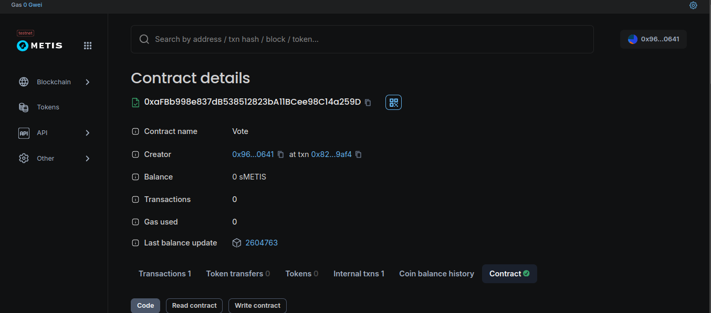

# Week 4

## Contract

### [0xaFBb998e837dB538512823bA11BCee98C14a259D](https://sepolia-explorer.metisdevops.link/address/0xaFBb998e837dB538512823bA11BCee98C14a259D?tab=contract)



### How to deploy

```bash
npx hardhat ignition deploy ignition/modules/Vote.js --network metis_testnet
```

## Overflow and Underflow in Solidity

### **Overflow vs. Underflow in Solidity**  

In Solidity, **overflow** and **underflow** occur when arithmetic operations exceed the valid range of a data type.  

- **Overflow** happens when a value **exceeds** the maximum limit of its type and wraps around to the minimum value.  
  - Example: `uint8` (0 to 255)  
  
    ```solidity
    uint8 x = 255;
    x += 1; // Overflow! x becomes 0
    ```
  
- **Underflow** happens when a value **goes below** the minimum limit of its type and wraps around to the maximum value.  
  - Example: `uint8` (0 to 255)  

    ```solidity
    uint8 y = 0;
    y -= 1; // Underflow! y becomes 255
    ```
